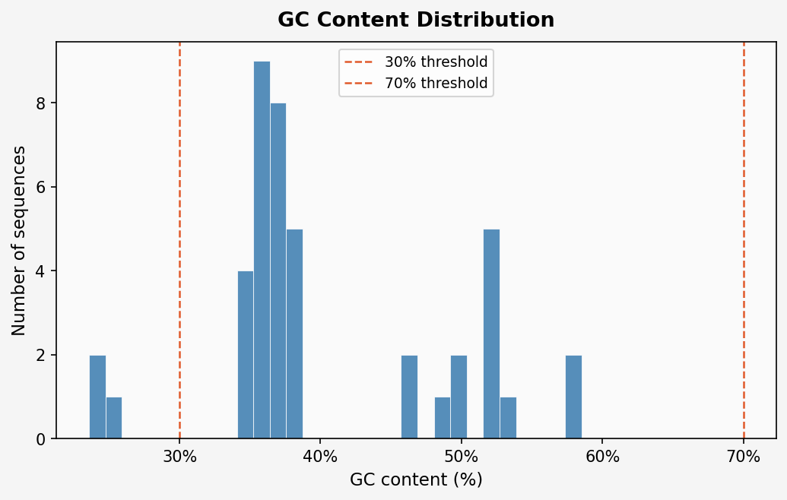
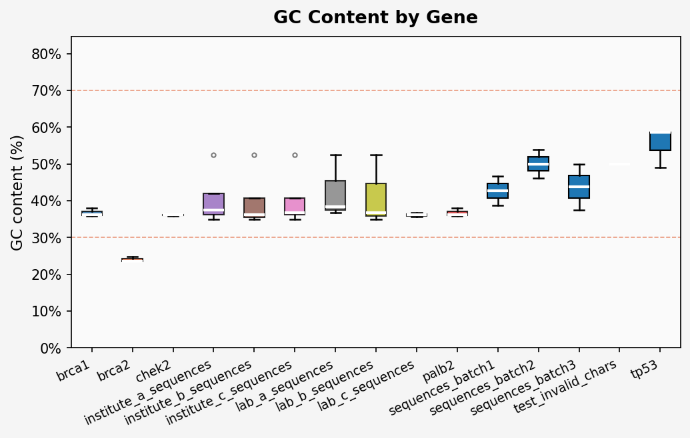
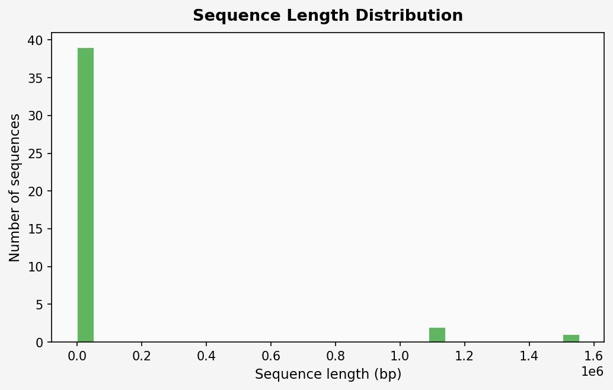
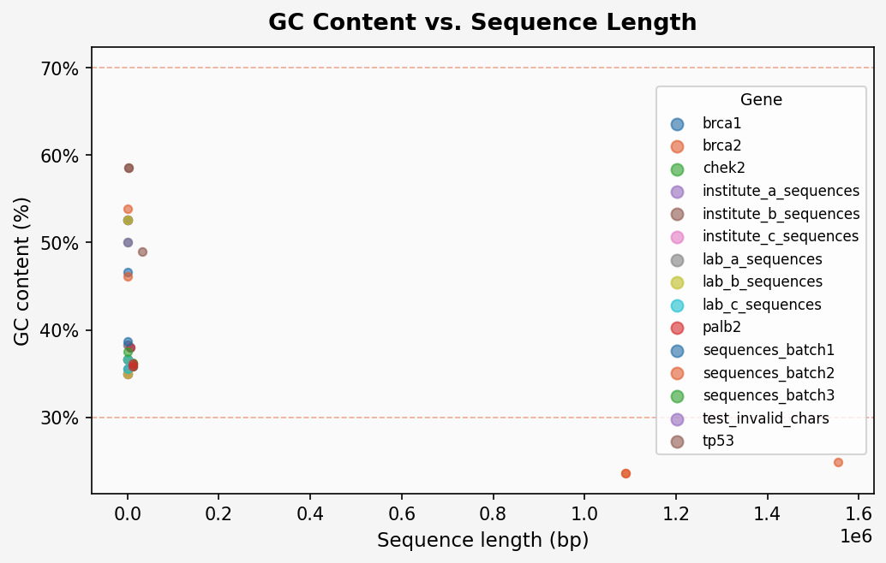
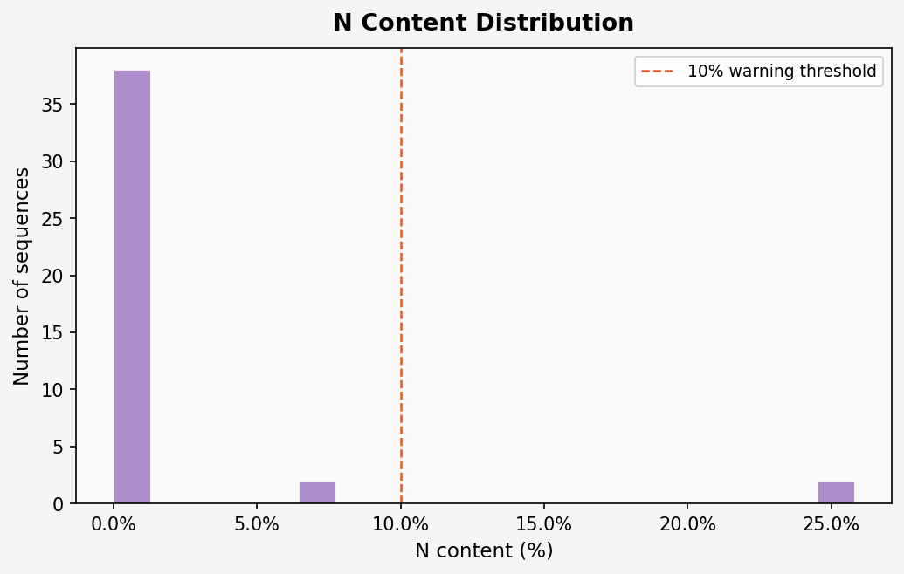
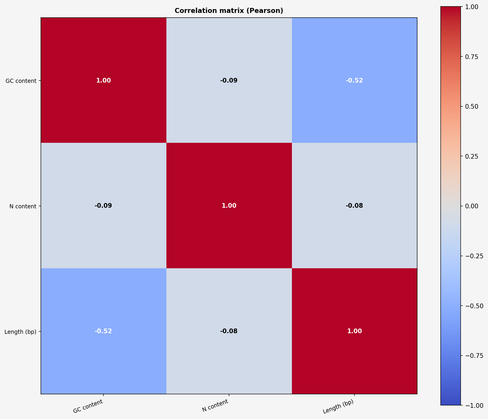

# BioSeq Explorer — Analysis Report

**Generated:** 2026-06-12 14:07  
**Dataset:** `C:\Users\ewary\PycharmProjects\bioseq_explorer\results\tables\clean_dataset_A.csv`  
**HUBA report:** loaded  

---

## 1. Dataset Summary

| Parameter | Value |
|-----------|-------|
| Total sequences | 42 |
| Gene sources | 15 |
| Flagged sequences | 5 |

## 2. Quality Control — Summary Statistics

| Metric | Mean | Median | Std | Min | Max | Q25 | Q75 |
|--------|------|--------|-----|-----|-----|-----|-----|
| GC content | 40.39% | 36.67% | 8.74% | 23.59% | 58.53% | 35.86% | 48.38% |
| N content | 1.53% | 0.00% | 5.60% | 0.00% | 25.81% | 0.00% | 0.00% |
| Length (bp) | 92146.2 | 60.0 | 328873.5 | 12.0 | 1554651.0 | 59.0 | 10649.0 |

## 3. Per-Gene Statistics

| Gene / Source | Mean GC% | Mean N% | Mean Length (bp) |
|---------------|----------|---------|-----------------|
| brca1_sequences.fasta | 36.69% | 0.000% | 10262.7 |
| brca2_sequences.fasta | 24.02% | 0.000% | 1244236.3 |
| chek2_sequences.fasta | 36.09% | 0.000% | 11874.7 |
| institute_a_sequences.tsv | 40.64% | 0.000% | 59.8 |
| institute_b_sequences.tsv | 39.95% | 1.690% | 59.5 |
| institute_c_sequences.tsv | 40.22% | 0.000% | 59.8 |
| lab_a_sequences.csv | 42.51% | 0.000% | 59.7 |
| lab_b_sequences.csv | 41.40% | 0.000% | 59.7 |
| lab_c_sequences.csv | 36.13% | 3.390% | 59.5 |
| palb2_sequences.fasta | 36.69% | 0.000% | 10262.7 |
| sequences_batch1.fasta | 42.69% | 12.900% | 30.5 |
| sequences_batch2.fasta | 50.00% | 0.000% | 26.0 |
| sequences_batch3.fasta | 43.75% | 12.500% | 34.0 |
| test_invalid_chars.csv | 50.00% | 0.000% | 12.0 |
| tp53_sequences.fasta | 55.33% | 0.000% | 12948.3 |

## 4. Visualizations

### GC Content Distribution

### GC Content by Gene

### Sequence Length Distribution

### GC% vs. Sequence Length

### N Content Distribution

### Correlation Matrix

## 5. Statistical Test Results

_No tests were run._

